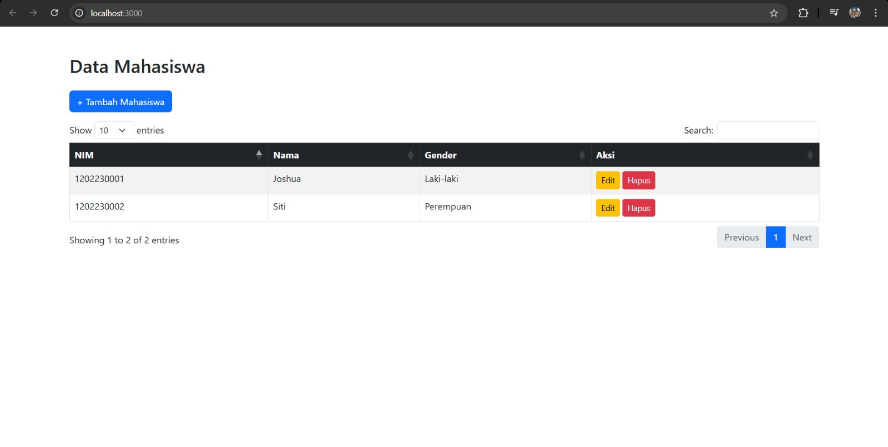
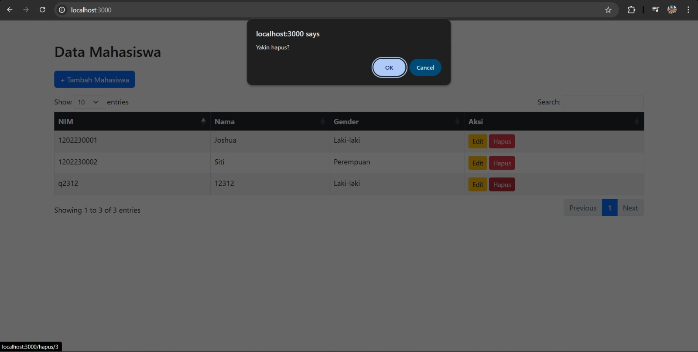
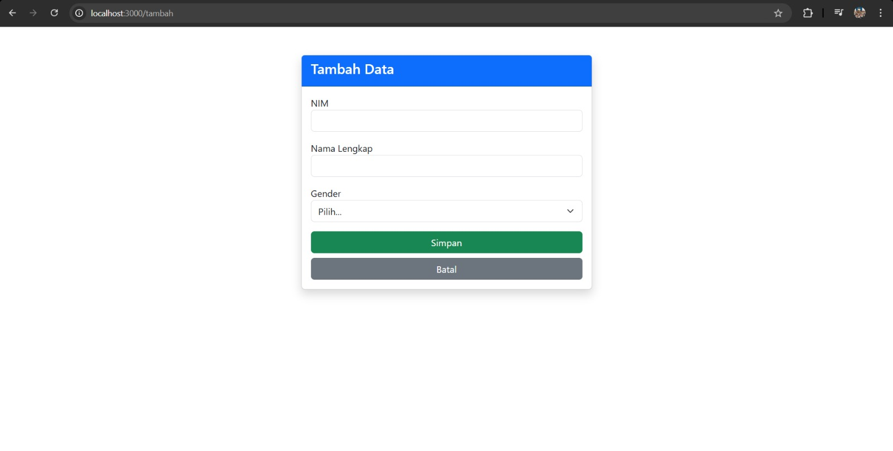
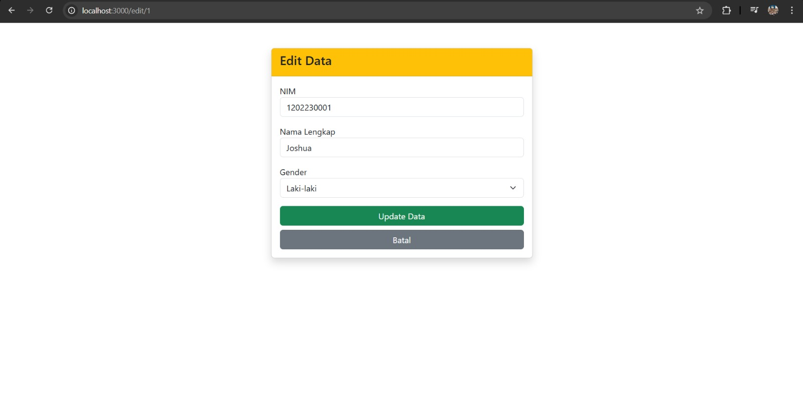

Ini adalah versi **Final & Paling Rapih**. Aku sudah perbaiki semua tanda bacanya biar di GitHub nanti:
1. [cite_start]Setiap file punya kotak kodenya sendiri-sendiri (nggak nyampur). [cite: 1, 2]
2. [cite_start]Penjelasan per file ada di bawah kotaknya masing-masing (persis kayak punya Nizal). [cite: 1, 2]
3. [cite_start]Gambar-gambar tampil dengan benar. [cite: 1, 2]

**Langsung COPY SEMUA teks di bawah ini:**

---

<h1 align="center">LAPORAN PRAKTIKUM</h1>
<h1 align="center">APLIKASI BERBASIS PLATFORM</h1>

<br>

<h2 align="center">TUGAS COTS MONEV 1</h2>
<h2 align="center">CRUD DATA MAHASISWA</h2>

<br>

<p align="center">
  
</p>

<br>

<h2 align="center">Disusun Oleh :</h2>

<p align="center" style="font-size:24px;">
  <b>Christoba Joshua Hutagalung</b><br>
  <b>2311102133</b><br>
  <b>S1 Teknik Informatika 2023</b>
</p>

<br>

<h2 align="center">Dosen Pengampu :</h2>

<p align="center" style="font-size:24px;">
  <b>Cahyo Prihantoro, S.Kom., M.Eng</b>
</p>

<br><br>

<h2 align="center">LABORATORIUM HIGH PERFORMANCE<br>FAKULTAS INFORMATIKA<br>UNIVERSITAS TELKOM PURWOKERTO<br>TAHUN 2026</h2>

<hr>

## 1. Dasar Teori

* [cite_start]**HTML (HyperText Markup Language):** Merupakan bahasa dasar yang digunakan untuk membangun sebuah web dimana HTML menangani elemen-elemen dasar pada struktur sebuah website. [cite: 1]
* **CSS & Bootstrap:** Merupakan framework yang membantu memperindah tampilan dari laman web. [cite_start]Aplikasi ini menggunakan Bootstrap 5 melalui CDN untuk mempercepat pengembangan antarmuka web. [cite: 1]
* **Pure Node.js:** Aplikasi ini dibangun menggunakan Node.js murni tanpa framework tambahan. [cite_start]Proses routing dan penyajian data JSON ditangani langsung menggunakan modul bawaan `http` dan `fs`. [cite: 1]
* **JQuery & DataTables:** Library Javascript yang mempermudah manipulasi DOM. [cite_start]Digunakan untuk menampilkan data mahasiswa dalam bentuk tabel secara dinamis yang bersumber dari API JSON lokal. [cite: 1]
* **JSON (JavaScript Object Notation):** Format pertukaran data yang ringan. [cite_start]Digunakan untuk mengirim data dari server ke client untuk dirender ke dalam tabel secara dinamis. [cite: 1]

<br>

## 2. Struktur Direktori

[cite_start]Aplikasi ini sangat ringan dan efisien karena tidak memerlukan folder `node_modules`. [cite: 1, 2]

```text
2311102133_CRUD-MAHASISWA/
│
├── assets/                # Folder untuk menyimpan screenshot laporan
│   ├── LogoTelkom.png
│   ├── home.jpeg          # Halaman utama (tabel)
│   ├── tambahdata.jpeg    # Form tambah
│   ├── editdata.jpeg      # Form edit
│   └── hapusdata.jpeg     # Pop up konfirmasi hapus
│
├── views/                 # Folder frontend (tampilan HTML)
│   ├── index.html         # Halaman utama (tabel)
│   ├── tambah.html        # Halaman form tambah data
│   └── edit.html          # Halaman edit data
│
├── server.js              # Backend (Pure NodeJS, API CRUD)
│
├── package.json           # Konfigurasi project
└── README.md              # Dokumentasi aplikasi
```

<br>

## 3. Struktur Halaman

### Halaman Home / Tampil Data
Halaman utama yang menampilkan tabel mahasiswa memakai jQuery DataTables. [cite_start]Data diambil dari server dalam format JSON. [cite: 1, 2]
<br>

<br>
[cite_start]Terdapat pop-up konfirmasi bawaan browser saat tombol hapus ditekan. [cite: 1, 2]
<br>


### Halaman Form (Tambah Data)
[cite_start]Digunakan untuk menambahkan data mahasiswa baru melalui method POST. [cite: 1, 2]
<br>


### Halaman Edit (Edit Data)
[cite_start]Digunakan untuk memperbarui data mahasiswa berdasarkan ID yang dipilih. [cite: 1, 2]
<br>


<br>

## 4. Kode Program

### A. server.js (Backend)

```javascript
const http = require('http');
const fs = require('fs');
const url = require('url');
const qs = require('querystring'); 

let dataMahasiswa = [
    { id: 1, nim: "1202230001", nama: "Christoba Joshua", gender: "Laki-laki" },
    { id: 2, nim: "1202230002", nama: "Siti Fotonah", gender: "Perempuan" }
];

const server = http.createServer((req, res) => {
    const reqUrl = url.parse(req.url, true);
    const path = reqUrl.pathname;

    if (path === '/' && req.method === 'GET') {
        fs.readFile('./views/index.html', (err, content) => {
            res.writeHead(200, { 'Content-Type': 'text/html' });
            res.end(content);
        });
    }
    else if (path === '/api/mahasiswa' && req.method === 'GET') {
        res.writeHead(200, { 'Content-Type': 'application/json' });
        res.end(JSON.stringify(dataMahasiswa));
    }
    else if (path === '/tambah' && req.method === 'GET') {
        fs.readFile('./views/tambah.html', (err, content) => {
            res.writeHead(200, { 'Content-Type': 'text/html' });
            res.end(content);
        });
    }
    else if (path === '/tambah' && req.method === 'POST') {
        let bodyForm = '';
        req.on('data', chunk => { bodyForm += chunk.toString(); });
        req.on('end', () => {
            const formData = qs.parse(bodyForm);
            const newId = dataMahasiswa.length > 0 ? dataMahasiswa[dataMahasiswa.length - 1].id + 1 : 1;
            dataMahasiswa.push({ id: newId, nim: formData.nim, nama: formData.nama, gender: formData.gender });
            res.writeHead(302, { 'Location': '/' });
            res.end();
        });
    }
    else if (path.startsWith('/edit/') && req.method === 'GET') {
        const idMhs = parseInt(path.split('/')[2]);
        const mhs = dataMahasiswa.find(m => m.id === idMhs);
        if (mhs) {
            fs.readFile('./views/edit.html', 'utf8', (err, content) => {
                let htmlSiapTampil = content
                    .replace('{{id}}', mhs.id).replace('{{nim}}', mhs.nim).replace('{{nama}}', mhs.nama)
                    .replace('{{select_L}}', mhs.gender === 'Laki-laki' ? 'selected' : '')
                    .replace('{{select_P}}', mhs.gender === 'Perempuan' ? 'selected' : '');
                res.writeHead(200, { 'Content-Type': 'text/html' });
                res.end(htmlSiapTampil);
            });
        }
    }
    else if (path.startsWith('/edit/') && req.method === 'POST') {
        const idMhs = parseInt(path.split('/')[2]);
        let bodyForm = '';
        req.on('data', chunk => { bodyForm += chunk.toString(); });
        req.on('end', () => {
            const formData = qs.parse(bodyForm);
            const indexMhs = dataMahasiswa.findIndex(m => m.id === idMhs);
            if (indexMhs !== -1) {
                dataMahasiswa[indexMhs].nim = formData.nim;
                dataMahasiswa[indexMhs].nama = formData.nama;
                dataMahasiswa[indexMhs].gender = formData.gender;
            }
            res.writeHead(302, { 'Location': '/' });
            res.end();
        });
    }
    else if (path.startsWith('/hapus/') && req.method === 'GET') {
        const idMhs = parseInt(path.split('/')[2]);
        dataMahasiswa = dataMahasiswa.filter(m => m.id !== idMhs);
        res.writeHead(302, { 'Location': '/' });
        res.end();
    }
});

server.listen(3000, () => console.log('Server MONEV jalan di http://localhost:3000'));
```

**Penjelasan `server.js`:**
Aplikasi backend menggunakan Pure Node.js murni untuk mengelola data mahasiswa dalam bentuk array di memori. [cite_start]Modul bawaan `http` digunakan untuk membuat server, `fs` untuk membaca file HTML, dan `querystring` untuk mengambil data dari form input. [cite: 1, 2]

### B. /views/index.html (Tabel Data)

```html
<!DOCTYPE html>
<html lang="id">
<head>
    <title>Data Mahasiswa</title>
    <link href="[https://cdn.jsdelivr.net/npm/bootstrap@5.3.0/dist/css/bootstrap.min.css](https://cdn.jsdelivr.net/npm/bootstrap@5.3.0/dist/css/bootstrap.min.css)" rel="stylesheet">
    <link rel="stylesheet" href="[https://cdn.datatables.net/1.13.6/css/dataTables.bootstrap5.min.css](https://cdn.datatables.net/1.13.6/css/dataTables.bootstrap5.min.css)">
</head>
<body class="bg-light">
    <div class="container mt-5">
        <div class="card shadow-sm">
            <div class="card-body">
                <h3 class="mb-4 text-center">Data Mahasiswa (Tugas CRUD MONEV)</h3>
                <a href="/tambah" class="btn btn-primary mb-4">+ Input Mahasiswa Baru</a>
                
                <table id="tabelMhs" class="table table-hover table-bordered" style="width:100%">
                    <thead class="table-dark">
                        <tr>
                            <th>NIM</th>
                            <th>Nama Lengkap</th>
                            <th>Gender</th>
                            <th class="text-center">Aksi</th>
                        </tr>
                    </thead>
                    <tbody></tbody>
                </table>
            </div>
        </div>
    </div>

    <script src="[https://code.jquery.com/jquery-3.7.0.min.js](https://code.jquery.com/jquery-3.7.0.min.js)"></script>
    <script src="[https://cdn.datatables.net/1.13.6/js/jquery.dataTables.min.js](https://cdn.datatables.net/1.13.6/js/jquery.dataTables.min.js)"></script>
    <script src="[https://cdn.datatables.net/1.13.6/js/dataTables.bootstrap5.min.js](https://cdn.datatables.net/1.13.6/js/dataTables.bootstrap5.min.js)"></script>
    <script>
        $(document).ready(function() {
            $('#tabelMhs').DataTable({
                ajax: { url: '/api/mahasiswa', dataSrc: '' },
                columns: [
                    { data: 'nim' }, { data: 'nama' }, { data: 'gender' },
                    { data: null, className: "text-center", render: function(data, type, row) {
                            return `<a href="/edit/${row.id}" class="btn btn-warning btn-sm">Edit</a>
                                    <a href="/hapus/${row.id}" class="btn btn-danger btn-sm" onclick="return confirm('Serius nih mau dihapus datanya?')">Hapus</a>`;
                        }
                    }
                ]
            });
        });
    </script>
</body>
</html>
```

**Penjelasan `/views/index.html`:**
Halaman utama yang menampilkan data dalam tabel interaktif menggunakan jQuery DataTables. [cite_start]Data diambil secara asynchronous lewat AJAX menuju endpoint `/api/mahasiswa` dalam format JSON. [cite: 1, 2]

### C. /views/tambah.html (Tambah Data)

```html
<!DOCTYPE html>
<html lang="id">
<head>
    <title>Tambah Mahasiswa</title>
    <link href="[https://cdn.jsdelivr.net/npm/bootstrap@5.3.0/dist/css/bootstrap.min.css](https://cdn.jsdelivr.net/npm/bootstrap@5.3.0/dist/css/bootstrap.min.css)" rel="stylesheet">
</head>
<body class="bg-light">
    <div class="container mt-5">
        <div class="card shadow-sm" style="max-width: 600px; margin: auto;">
            <div class="card-header bg-primary text-white"><h5 class="mb-0">Form Tambah Data</h5></div>
            <div class="card-body">
                <form action="/tambah" method="POST">
                    <div class="mb-3">
                        <label class="form-label">Nomor Induk Mahasiswa (NIM)</label>
                        <input type="number" name="nim" class="form-control" required>
                    </div>
                    <div class="mb-3">
                        <label class="form-label">Nama Lengkap</label>
                        <input type="text" name="nama" class="form-control" required>
                    </div>
                    <div class="mb-4">
                        <label class="form-label">Jenis Kelamin</label>
                        <select name="gender" class="form-select" required>
                            <option value="" disabled selected>Pilih Gender...</option>
                            <option value="Laki-laki">Laki-laki</option>
                            <option value="Perempuan">Perempuan</option>
                        </select>
                    </div>
                    <button type="submit" class="btn btn-success">Simpan Data</button>
                    <a href="/" class="btn btn-outline-secondary float-end">Kembali</a>
                </form>
            </div>
        </div>
    </div>
</body>
</html>
```

**Penjelasan `/views/tambah.html`:**
[cite_start]Halaman form untuk menambah data mahasiswa baru menggunakan method POST. [cite: 1, 2]

### D. /views/edit.html (Update Data)

```html
<!DOCTYPE html>
<html lang="id">
<head>
    <title>Edit Mahasiswa</title>
    <link href="[https://cdn.jsdelivr.net/npm/bootstrap@5.3.0/dist/css/bootstrap.min.css](https://cdn.jsdelivr.net/npm/bootstrap@5.3.0/dist/css/bootstrap.min.css)" rel="stylesheet">
</head>
<body class="bg-light">
    <div class="container mt-5">
        <div class="card shadow-sm" style="max-width: 600px; margin: auto;">
            <div class="card-header bg-warning"><h5 class="mb-0">Form Edit Data</h5></div>
            <div class="card-body">
                <form action="/edit/{{id}}" method="POST">
                    <div class="mb-3">
                        <label class="form-label">Nomor Induk Mahasiswa (NIM)</label>
                        <input type="number" name="nim" class="form-control" value="{{nim}}" required>
                    </div>
                    <div class="mb-3">
                        <label class="form-label">Nama Lengkap</label>
                        <input type="text" name="nama" class="form-control" value="{{nama}}" required>
                    </div>
                    <div class="mb-4">
                        <label class="form-label">Jenis Kelamin</label>
                        <select name="gender" class="form-select" required>
                            <option value="Laki-laki" {{select_L}}>Laki-laki</option>
                            <option value="Perempuan" {{select_P}}>Perempuan</option>
                        </select>
                    </div>
                    <button type="submit" class="btn btn-success">Update Data</button>
                    <a href="/" class="btn btn-outline-secondary float-end">Batal</a>
                </form>
            </div>
        </div>
    </div>
</body>
</html>
